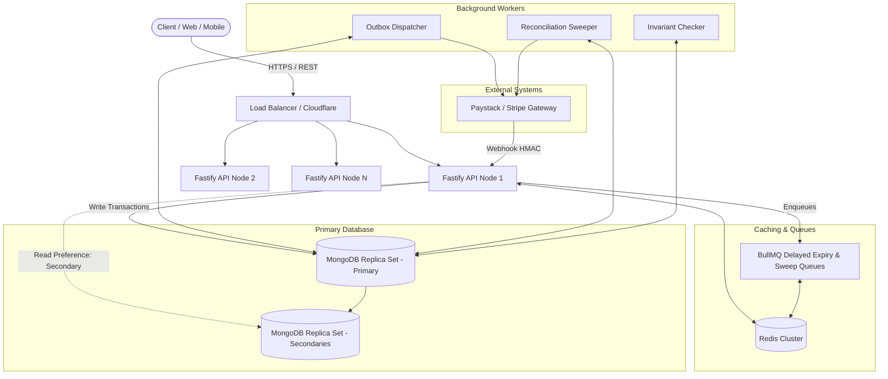
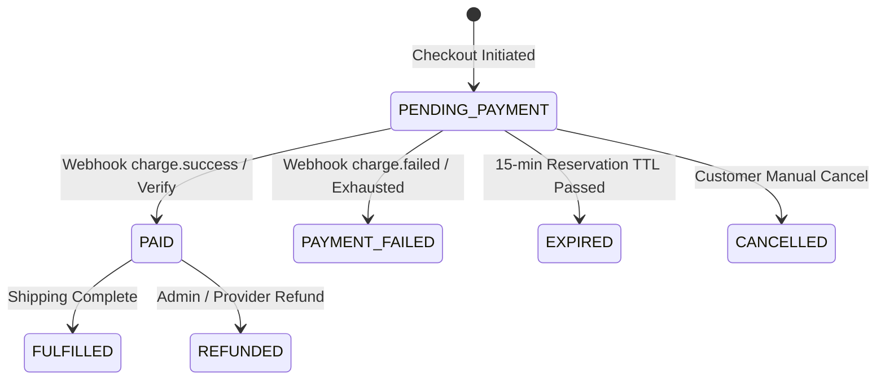
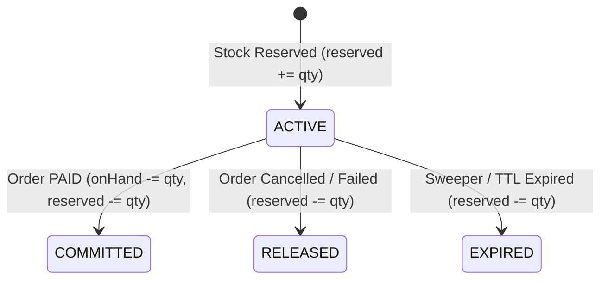

# System Architecture & Technical Design Document

This document details the architectural decisions, concurrency controls, data integrity invariants, and scalability strategies implemented in the **High-Scale E-Commerce Backend**.

---

## 1. Goals, Non-Goals & Core Invariants

### 1.1 Goals

- **Provable Correctness:** Zero overselling, zero double-billing, and zero orphaned inventory under extreme concurrency.
- **Horizontal Scalability:** Support millions of active users through stateless application containers, cursor pagination, and database read/write optimization.
- **Resilience & Fault Tolerance:** Graceful degradation on third-party payment outages via Circuit Breakers, transactional outbox retries, and asynchronous reconciliation.
- **Zero Ambiguity Security:** Strict role-based access control, anti-IDOR resource scoping, timing-safe webhook verification, and rotating token families.

### 1.2 Non-Goals

- Proprietary PCI-DSS card storage (delegated entirely to compliant third-party payment providers like Paystack/Stripe).
- Complex warehouse physical fulfillment logistics (scoped to digital order state machine: `PAID → FULFILLED`).

### 1.3 Core Business Invariants

1. **Stock Non-Negative & Bound Invariant:** For every SKU, `0 <= reserved <= onHand`.
2. **Order Totals Consistency:** `grandTotalMinor = subtotalMinor + taxMinor + shippingMinor`. Client price inputs are completely ignored.
3. **Idempotency Invariant:** A repeated mutation with the same idempotency key and identical payload produces an identical response without duplicate side effects.
4. **Order State Determinism:** A `PAID` order can never transition backward to `PENDING_PAYMENT` or `CANCELLED`.

---

## 2. Architecture Overview



---

## 3. Data Model & Index Rationale

| Collection             | Key Fields                                                             | Indexes & Rationale                                                                                                                               |
| ---------------------- | ---------------------------------------------------------------------- | ------------------------------------------------------------------------------------------------------------------------------------------------- |
| **`users`**            | `email`, `passwordHash`, `role`, `tokenVersion`                        | `email: 1` (unique) for fast auth lookups; `tokenVersion` for global session invalidation.                                                        |
| **`products`**         | `slug`, `priceMinor`, `currency`, `category`, `isAvailable`, `version` | `slug: 1` (unique); `(category, createdAt, _id)` for compound keyset pagination; text index on `name` and `description` for search.               |
| **`inventory`**        | `productId`, `onHand`, `reserved`                                      | `productId: 1` (unique shard key). Hot row for atomic conditional updates.                                                                        |
| **`reservations`**     | `orderId`, `items`, `status`, `expiresAt`                              | `orderId: 1` (unique); `(status, expiresAt)` for the 1-minute expiration sweeper.                                                                 |
| **`orders`**           | `userId`, `status`, `lines`, `totals`, `idempotencyKey`                | `(userId, idempotencyKey)` (unique compound) to prevent duplicate checkouts; `(userId, createdAt, _id)` for keyset pagination without IDOR leaks. |
| **`payments`**         | `orderId`, `provider`, `reference`, `status`, `amountMinor`            | `reference: 1` (unique) preventing duplicate payment records across gateways.                                                                     |
| **`outbox`**           | `type`, `payload`, `status`, `leaseExpiresAt`, `retryCount`            | `(status, leaseExpiresAt)` for high-throughput skip-locked worker polling.                                                                        |
| **`webhook_events`**   | `provider`, `eventId`, `status`                                        | `(provider, eventId)` (unique compound) for Layer-1 event deduplication. TTL index for automatic pruning.                                         |
| **`idempotency_keys`** | `userId`, `key`, `requestHash`, `response`, `expiresAt`                | `(userId, key)` (unique compound); `expiresAt` TTL index for automatic 24-hour cleanup.                                                           |
| **`audit_logs`**       | `actorRole`, `action`, `targetType`, `targetId`, `diff`, `ip`          | `(targetType, targetId, createdAt)` and `(actorId, createdAt)` for compliance investigations.                                                     |

---

## 4. State Machines

### 4.1 Order Lifecycle



### 4.2 Reservation Lifecycle



---

## 5. Core Correctness Scenarios (A – F)

### Scenario A: Concurrent Purchase of the Last Items (Zero Oversell)

- **Problem:** Multiple customers attempt to buy the final units of inventory simultaneously. Naive read-then-write logic leads to overselling.
- **Approach:** Atomic conditional update executed directly at the database engine level inside a snapshot transaction:
  ```ts
  const res = await Inventory.updateOne(
    { productId, $expr: { $gte: [{ $subtract: ['$onHand', '$reserved'] }, qty] } },
    { $inc: { reserved: qty } },
    { session },
  );
  if (res.modifiedCount === 0) throw new ConflictError('Insufficient stock');
  ```
- **Why It's Correct:** MongoDB WiredTiger locks the document during write. The condition `$subtract: ['$onHand', '$reserved'] >= qty` is evaluated atomically. The second transaction encounters an unsatisfied filter and is rejected.
- **Failure Modes:** Transaction write conflict (code 112). Handled transparently by `withRetryableTransaction` with exponential backoff and full jitter.
- **Trade-Offs:** Single-row write contention under massive flash sales. Mitigated via stock bucketing at scale (see Section 7).

---

### Scenario B: Prices Change While Items Sit in Carts

- **Problem:** A customer adds an item at ₦10,000. Before checkout, an admin changes the price to ₦15,000. Charging ₦10,000 causes merchant loss; charging ₦15,000 without consent is deceptive.
- **Approach:**
  1. Cart documents store only `productId` and `qty`, never prices.
  2. `GET /cart` re-prices live against current catalog prices.
  3. Client submits `expectedTotalMinor`. If computed price differs, the server halts checkout with `409 PRICE_CHANGED` and returns updated items.
  4. Once checked out, the order snapshots line items and totals permanently.
- **Why It's Correct:** Guarantees mutual agreement between buyer and merchant before charging.

---

### Scenario C: Partial Checkout Failures & Compensation

- **Problem:** Stock is reserved, but the network call to initialize payment or clear cart fails.
- **Approach:**
  1. Multi-document transaction groups: stock reservation, order creation (`PENDING_PAYMENT`), payment record creation, and outbox event creation.
  2. Gateway calls are **never** held inside a database transaction (prevents pool exhaustion).
  3. The outbox processor handles payment dispatch and cart clearing asynchronously with exponential backoff. If retries exhaust, compensating transactions mark the order `PAYMENT_FAILED` and release stock.
- **Why It's Correct:** Guarantees that local database state is 100% consistent regardless of external network anomalies.

---

### Scenario D: User Abandons Browser During Payment

- **Problem:** Customer authorizes payment but closes browser before redirecting to the confirmation page.
- **Approach:** 3-tier convergence on `markPaid()`:
  1. **Webhook (Primary):** Gateway notifies backend server-to-server.
  2. **Callback / Redirect:** Browser queries `GET /orders/:id/verify-payment`.
  3. **Reconciliation Sweeper:** Every minute, queries pending orders near expiration, calling `provider.verify(reference)`.
- **Why It's Correct:** Eliminates dependence on user client behavior. Stock is committed if paid, or released if truly abandoned.

---

### Scenario E: Duplicate Webhooks (3-Layer Idempotency)

- **Problem:** Gateways retry webhooks aggressively on transient network timeouts.
- **Approach:**
  - **Layer 1 (Event-Level):** Unique index `(provider, eventId)` in `webhook_events`. Duplicates return HTTP 200 immediately.
  - **Layer 2 (State Machine Guard):** Atomic conditional transition: `updateOne({ _id: orderId, status: 'PENDING_PAYMENT' }, { $set: { status: 'PAID' } })`.
  - **Layer 3 (Side-Effect Guard):** Reservation commit condition `status: 'ACTIVE' → 'COMMITTED'`. Stock cannot be deducted twice.
- **Why It's Correct:** Even if two webhook threads run simultaneously, only one satisfies the conditional update.

---

### Scenario F: Deduct Immediately vs. Temporary Reservation

- **Decision:** **Reservation with TTL (15 minutes).**
- **Rationale:**
  - Deducting immediately strands stock on abandoned carts or payment failures.
  - Deducting after payment introduces overselling if stock runs out while the user is filling out payment forms.
  - Temporary reservation guarantees stock availability during payment while automatically releasing stranded inventory via BullMQ delayed jobs and sweepers.

---

## 6. Security Model & IDOR Prevention

1. **Authentication:**
   - Passwords hashed using **Argon2id** (memory cost 64MB, time cost 3, 4 threads).
   - Short-lived Access Tokens (15m) + Rotating Refresh Tokens (7d).
   - Refresh token family tracking detects token reuse and revokes entire family immediately.
2. **Anti-IDOR (Insecure Direct Object Reference):**
   - All customer routes enforce ownership via `findOwnedOrThrow(Model, id, userId)`.
   - Unauthorized access returns **404 NOT_FOUND** rather than 403 to prevent resource enumeration.
3. **Role-Based Access Control (RBAC):**
   - Routes guarded with `requireRole(['admin'])`.
   - Customer tokens attempting admin routes receive **403 FORBIDDEN**.
4. **Webhook Security:**
   - Raw payload captured prior to JSON parsing.
   - HMAC SHA-512 signature verified using `crypto.timingSafeEqual` against secret key.

---

## 7. Scaling to Millions of Users

### 7.1 Application Tier

- **Stateless Containers:** Zero local session state. Deployable on Kubernetes / ECS behind ALB.
- **Event Loop Preservation:** Zero synchronous cryptography on request paths. Argon2 runs in libuv threadpool (`UV_THREADPOOL_SIZE=16`).
- **Timeouts & Circuit Breakers:** HTTP connection timeout 10s, request timeout 30s. Gateway circuit breakers fast-fail with HTTP 503 during external outages.

### 7.2 Database Sharding & Read/Write Splitting

- **Sharding Strategy:**
  - `orders`, `payments`, `carts`: Shard key `hashed(userId)` ensures uniform write distribution across shards.
  - `products`: Unsharded replica set; read load offloaded to Redis and secondaries (`readPreference: secondaryPreferred`).
  - `inventory`: High-contention rows. For mega flash sales, split single SKU stock across $K$ sub-buckets (`stock_bucket_0`, `stock_bucket_1`, ...) to distribute lock contention.

### 7.3 Caching & Edge

- Keyset pagination with cursor `(createdAt, _id)` eliminates expensive `skip` operations.
- Redis cache-aside for product details and top categories with 60s TTL and jitter to prevent cache stampedes.
- `ETag` and `If-None-Match` support returns `304 Not Modified` directly at CDN edge.
